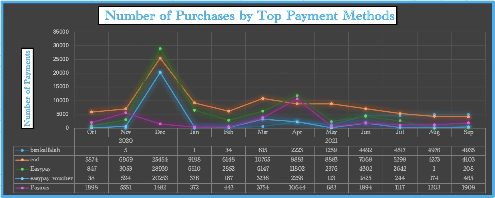
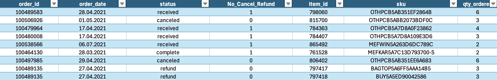
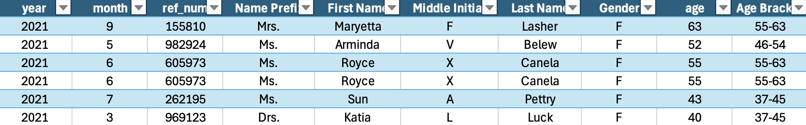
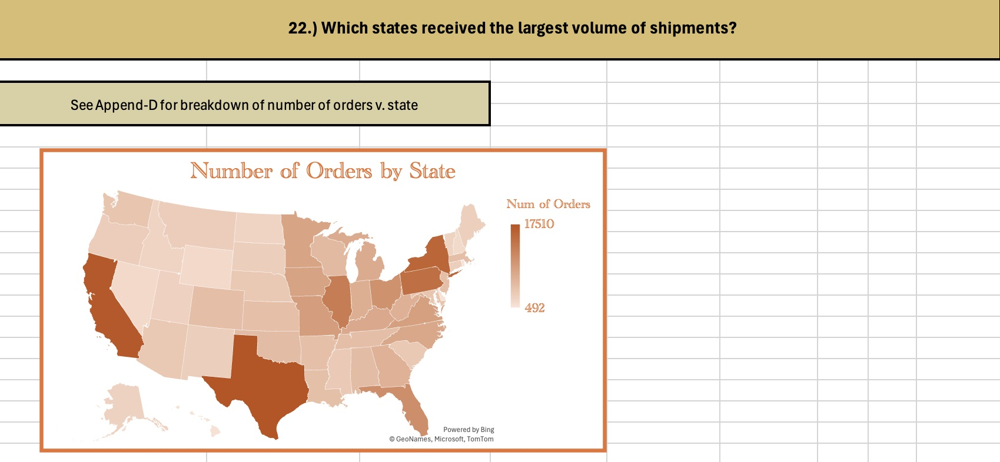
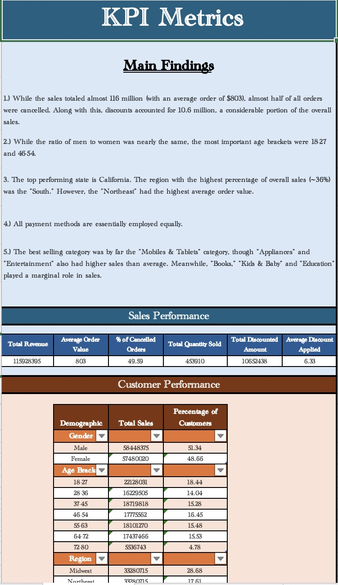
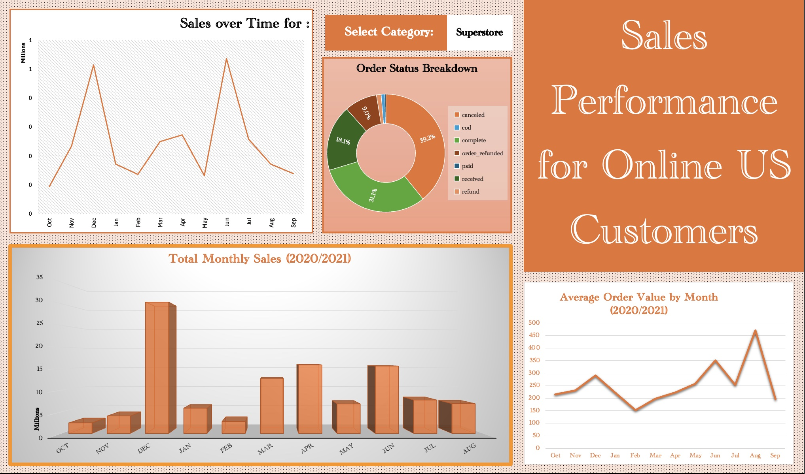
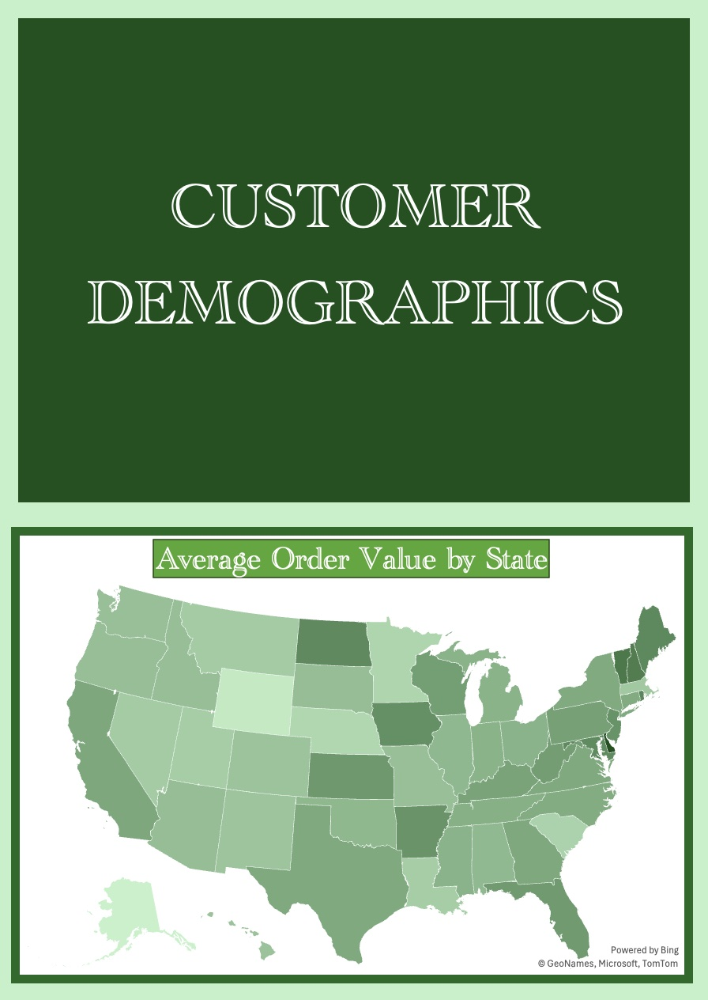

<h1 align="center" style="font-size: 2em;">
Selling to America: Retail Insights with Excel's Full Power
</h1>

Flip on the news and you’ll likely hear talk of China challenging America’s economic crown. But for now, the U.S. remains the heavyweight champion of global consumer spending — and this project dives into the numbers behind that title. Using Excel as my analytical scalpel, I dissected a simulated US online retail dataset to unearth the trends, behaviors, and metrics that power e-commerce.

  

Using a simulated dataset, I combed through every detail to deliver a fine-tuned analysis of the US online retail market for online retailing, just like one would when handling real-world data. From raw CSVs to clean dashboards, I used Excel end-to-end — performing data cleaning, feature creation, analytical breakdowns, and final dashboard visualizations. This project demonstrates that with the right structure and logic, Excel can go toe-to-toe with even heavyweight BI tools for mid-sized datasets.

  

The data for this project was obtained from [this Kaggle dataset](https://www.kaggle.com/datasets/ytgangster/online-sales-in-usa) and then cleaned, organized, analyzed and visualized. Please note that I had great difficulty uploading some of the files, and ultimately I have linked to a [Google Drive](https://drive.google.com/drive/folders/1FBdKn3uZx8Pd8-buH1F40iTSm6282SeS?usp=sharing); at least one of the files is solely available there. 

## Table of Contents

- [I. Included Files](#i-included-files)
- [II. Included Datasets](#ii-included-datasets)
- [III. A Cleaned and Enhanced Dataset](#iii-a-cleaned-and-enhanced-dataset)
- [IV. Data at the Click of a Mouse](#iv-data-at-the-click-of-a-mouse)
- [V. Dashboards: Sales and Demographics](#v-dashboards-sales-and-demographics)
- [VI. Tools Used](#vi-tools-used)
- [VII. Conclusion](#vii-conclusion)
- [VIII. Contact Info](#viii-contact-info)

## I. Included Files

- US Sales Dataset - Dashboard and KPIs (online_us_sales_dash_plus_kpi.xlsx)
     - KPI Metrics
     - Sales Performance DB
     - Customer Demographics DB
     - Calculations (of tables and charts used in dashboards)
- US Sales Dataset - Analysis (see [Google Drive](https://drive.google.com/drive/folders/1FBdKn3uZx8Pd8-buH1F40iTSm6282SeS?usp=sharing))
     - Analysis
     - Append-A (see Analysis Q. 8)
     - Append-B (see Analysis Q. 10)
     - Append-C (see Analysis Q. 12)
     - Append-D (see Analysis Q. 22)
- US Sales Dataset - Original (online_us_sales_dataset_OG.csv)
- US Sales Dataset - Cleaned (online_us_sales_dataset_cleaned.csv.zip)

## II. Included Datasets

- online_us_sales_dataset_cleaned.csv.zip
- online_us_sales_dataset_OG.csv

The dataset is available in its cleaned as well as original form. 

## III. A Cleaned and Enhanced Dataset

The file online_us_sales_dash_plus_kpi.xlsx is available for download and includes only the dashboards and KPI Metrics table. THe analysis, inclusive of BI questions and visualizations, is available via the Google Drive linked above. Along with this, one can view the original CSV file that was used as the source. Throughout this project, I employed Excel for all cleaning, analytics and visualizations.

  

While much of the data was already in place in terms of infrastructure, it was nonetheless necessary to make certain adjustments, refinements and modifications. To accomplish this, a variety of Excel functions were employed to make sure the data was standardized, accurate and usable. For instance, the discount percentage column had the number of decimal places reduced, dates were standardized, and currency columns reformatted to properly reflect monetary values. Along with this, I created a column to put customers into age brackets, which allows for more robust and concentrated analysis. I also created separate columns for year and month to make it easier to explore trends over time.

  

These changes enhanced the analytical resolution of the dataset, making it ready for pivot table manipulation, KPI assessments, and executive summaries.

## IV. Data at the Click of a Mouse

Once cleaned, it was time to listen to what the data was telling us. Taking advantage of the immense array of features, functions and formatting tools Excel had to offer, the project addresses key business-related inquiries necessary for making practical and beneficial decisions. These assessments can be found under the "Analysis" worksheet, and is color-coded for easier navigation (see below). For instance, below is an initial breakdown of average order value by demographics.

The main areas of concern are listed as follows:

- 🔵 Sales Trends and Insights
- 🟠 Discounts and Pricing Insights
- 🟣 Customer and Demographic Insights
- 🟢 Order and Operational Insights
- 🟡 Geographic and Regional Insights  

Each section is designed for stakeholders who want fast, contextual answers — not endless spreadsheets. Every analysis question targets a better understanding of the US e-commerce marketplace represented in the dataset. Of course, some limitations were inevitable — like the near-uniformity in gendered sales — but overall, the insights were clear and practical. However, in general, useful information was able to be extracted and presented to the viewer in a clean and tidy format, making sure my stakeholders are spending their time on their jobs and not on deciphering the results. 

  

The eventual findings of my analysis were condensed and formatted into a KPI Metrics table that I envisioned could serve as a handout, especially one that would allow the audience to follow along when covering the dashboards. A portion of this table is visible below, and the full version is visible in the Excel file. In the table, I've included the main findings and sections on the performance of sales, customers, categories and geolocations. This required extensive use of pivot tables, calculated fields, nested formulas and aggregations. 

  

The conclusions that were drawn from this analysis then guided the end goal: visualized dashboards. 

## V. Dashboards: Sales and Demographics 

Excel isn’t just for formulas and pivot tables — it’s also a storytelling tool. Its built-in versatility allows for a smoother, more integrated analysis experience. Along with this, the widespread use of Excel means users, even with a peripheral knowledge of Excel, will be able to navigate your work with ease -- thus making the business-side of things flow without as many road bumps. In this case, I took advantage of my analysis to spotlight two core elements I noticed: Sales and Customers.

The first dashboard addresses "Sales Performance for Online US Customers" by establishing elements of the data I wanted to highlight. The areas of concern were generally total monthly sales, monthly sales over time for each category (selectable from a dropdown menu), average order value by month and the breakdown of overall order status by percentages. That dashboard can be seen below.

  

The second dashboard took the opportunity to hone in on another quintessential aspect of sales for any business: "Customer Demographics." For this dashboard, I focused on the characteristics, qualities and information the dataset provided to give a breakdown of the impact of a variety of demographics. Included are the number of customers by age bracket, states with the highest order value, overall proportion of payment methods and total sales for each category by gender. A portion of that dashboard can be seen below, with the full version available in the Excel file itself. 

  

These dashboards pair insight with accessibility — ideal for marketing teams, financial analysts, or anyone trying to decode e-commerce behavior with just a glance.

## VI. Tools Used

- Excel 

## Conclusion

Excel isn’t just a spreadsheet tool — it’s a full-blown analytics environment when used intentionally. This project walks through the entire data lifecycle: from messy import to KPI dashboards. While the dataset was simulated, the logic, insights, and structure are designed for real-world business cases.

The scope of this dataset, which included hundreds of thousands of rows and dozens of fields, was perfect for demonstrating the power that is under the hood of Excel. Excel made it easy to clean and format the data efficiently, while still allowing for high-complexity analysis — including filters, calculated fields, pivot tables, and aggregations — all without sacrificing clarity or depth. The dashboards also serve as strong testaments to the versatility offered by Excel visualizations and interactions, allowing the data to "speak for itself," as one might say. 

## VIII. Contact Info

[Linkedin](www.linkedin.com/in/jacob-maze-8a4a0772)

[Personal Website](https://analyticsbyjake.github.io/abj/)

[GitHub](https://github.com/AnalyticsByJake)

[Tableau Public](https://public.tableau.com/app/profile/analyticsbyjake)

[Academia.edu](https://aauni.academia.edu/JacobMaze)
